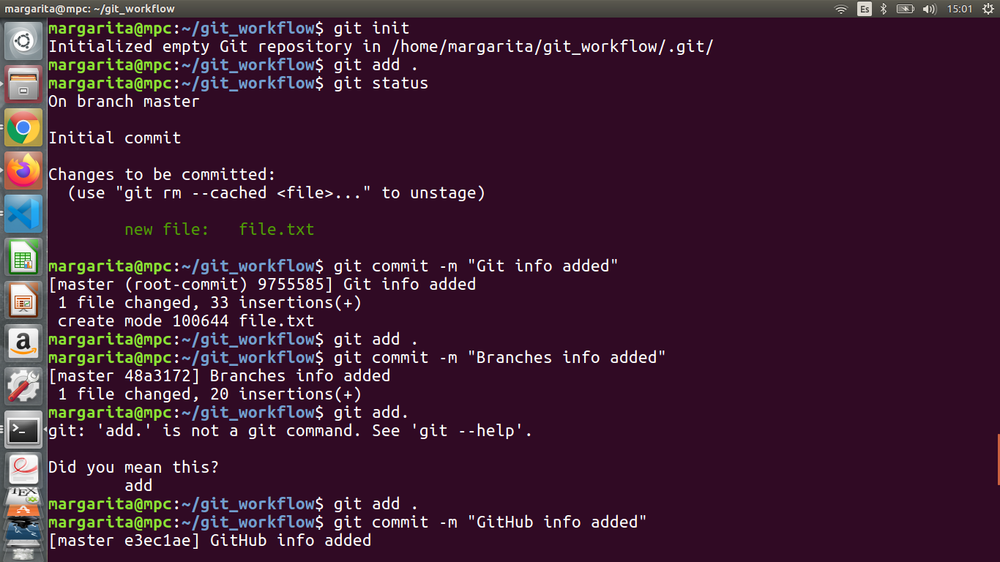

# using-git-and-github
**README.md** is a file written in markdown language and is a good practice for explain our repositories purpose in a clear and easier  way.  You can see it exemplify by this file written down bellow in the fancy format of markdown.

# GIT

Git allows us tracking the changes of any plain text!

#### ACCOUNT SETTINGS

- Go to   https://github.com and sign in
- To configure the account in our computer, we use:

 ***git config --global user.name "Your name here"***
 
  ***git config --global user.email "Your e-mail here"***
  
- For show the actual account, we use:
  ***git config --list***
  
  #### BASIC GIT AND GITHUB WORKFLOW:
  
  

To start tracking and controlling versions, follow the next steps:

1.- Inside the selected directory, we activate the system version control of Git by executing:

***git init***
 
 

2.- Change the untracked file status to staged by executing:

***git add file.extension***

Or to ad all the files to the repository:

 ***git add .***

3.- Move file changes or updates from untracked to staged by executing:

 ***git commit -m "comment something about the changes here"***

If we forgot to add comment to the commit, vim appears and requires the comment.
We type the comment in double quotes at the top of the screen and close vim presing  CTRL + SHIFT + zz

After doing add and commit (step 2 and 3) at least one time, we can use:
*** git commit -am "comment something about the changes here"***

#### USING BRANCHES

At the begining we are in the 'master' branch,

1.- To create a branch we use:

 ***git branch branch_name***

We can see the available branches by executing:

 ***git branch***

2.- Change branch by executing:

 ***git checkout branch_name***

4.- For MERGE branches by executing:

 ***git merge -m "comment something here"***

#### GITHUB

We can save all our progress and share it using GitHub. To do this we follow the next steps:

1.- Go to our brownser and then to the oficial GitHub page and we sign up

2.- Go to the 'add' icon at the upper-left of the screen and select 'New repository' or another option

3.- Fill the fields and click on 'create repositoty'. Initialize repository with README is a good practice

4.- Go to 'Clone or download repositoty' and copy the url

5.- Being in the master branch, create an origin by executing:

 ***git remote add origin "paste url here, it is gonna be the origin"***

We can see more info about the origin by executing:

 ***git remote or git remote  --v***

6.- Integrate remote changes to have all work locally:

 ***git pull origin master***

7.- Send the master branch to the origin:

 ***git push origin master***

There are a lot of more useful Git and GitHub functionalities, but for now,
you can start tracking your files using Git and GitHub and  share your work!

